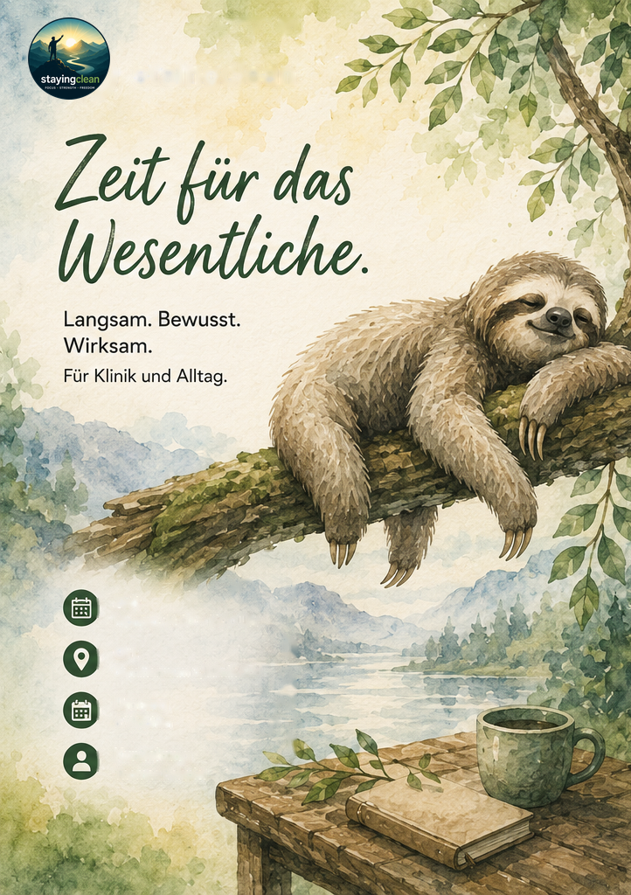
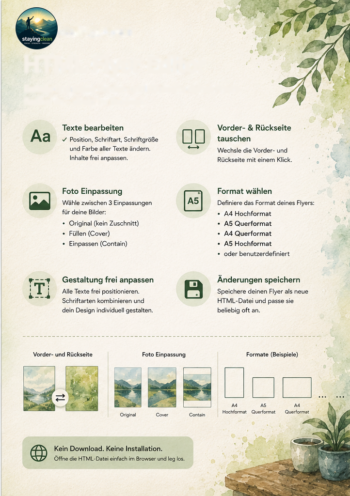

# Toolbox

Eine Sammlung eigenständiger, **im Browser laufender HTML-Werkzeuge** – ohne
Installation, ohne Server, ohne Konto. Jede Seite ist eine einzelne HTML-Datei
mit eingebettetem CSS/JavaScript und funktioniert auch komplett offline.

**Live:** https://stayingclean.github.io/toolbox/
(Veröffentlicht via GitHub Pages aus dem Ordner [`docs/`](docs/).)

## Enthaltene Werkzeuge

| Werkzeug | Beschreibung | Link |
|---|---|---|
| **Skillsliste** | Interaktive Skills zur Krisenbewältigung (nach Anspannungsgrad). | [öffnen](https://stayingclean.github.io/toolbox/skillsliste.html) |
| **Budgetvorlage** | Einnahmen & Ausgaben erfassen, mehrere Varianten vergleichen, drucken. | [öffnen](https://stayingclean.github.io/toolbox/budgetvorlage.html) |
| **Flyer-Editor** | Flyer direkt im Browser gestalten und als HTML-Datei speichern. | [öffnen](https://stayingclean.github.io/toolbox/neutral_flyer.html) |

---

## Flyer-Editor

Ein **vollständiger Flyer-Baukasten in einer einzigen HTML-Datei**. Öffnen,
gestalten, als neue HTML-Datei speichern – fertig. Der Editor und alle Bilder
sind in der Datei eingebettet; es wird nichts nachgeladen.

| Vorderseite | Rückseite |
|:---:|:---:|
|  |  |

### Funktionen im Detail

- **Texte bearbeiten & formatieren**
  Frei editierbare Textfelder mit voller Formatierung: **Schriftart** (Arial,
  Georgia, Times, Verdana, Tahoma, Courier, Segoe UI …), **Schriftgrösse**,
  **Fett / Kursiv / Unterstrichen / Durchgestrichen**, **Textfarbe**, Ausrichtung
  (links / zentriert / rechts), **Buchstabenabstand** und **Zeilenhöhe**.
  Formatierung mit einem Klick wieder entfernen.

- **Text auf Fotos lesbar machen**
  Je Feld optional **Kontur (Outline)** und **Textschatten** – mit eigener
  Konturfarbe –, damit Text auch auf Bildern gut lesbar bleibt.

- **Felder frei anordnen**
  Textfelder per Ziehen **verschieben** und in der **Grösse ändern**, neue Felder
  **hinzufügen** (Alt+N), aktives Feld **löschen** (Alt+Entf) oder **sperren**
  (Alt+L).

- **Ausrichten & verteilen**
  Mehrere Felder an Kanten ausrichten (links / rechts / oben / unten),
  horizontal/vertikal zentrieren und (ab 3 Feldern) gleichmässig verteilen.

- **Ebenen (Stapelreihenfolge)**
  Felder **nach vorne / hinten** legen (Alt+Bild↑ / Alt+Bild↓).

- **Bilder & Foto-Einpassung**
  Vorder- und Rückseiten-Bild ersetzen; Darstellung wählbar: **Füllen (Cover)**,
  **Ganz zeigen (Contain)** oder **Strecken** – plus Hintergrund der Seite.

- **QR-Code einfügen**
  QR-Code mit **frei wählbarem Inhalt** (z. B. Link) direkt auf den Flyer setzen.

- **Vorder- & Rückseite**
  Beide Seiten gestalten und mit **einem Klick tauschen**.

- **Format wählen**
  Seitengrösse **A3 / A4 / A5 / A6**, **Letter** oder **benutzerdefiniert**
  (Breite/Höhe in mm) – jeweils **Hoch-** oder **Querformat**.

- **Rückgängig / Wiederholen**
  Volle **Undo/Redo**-Unterstützung (Strg+Z / Strg+Y).

- **Tastenkürzel**
  Viele Aktionen per Shortcut; komplette Übersicht mit **F1**.

- **Speichern & Drucken**
  Fertigen Flyer als **neue HTML-Datei** speichern (Strg+S) und jederzeit
  weiterbearbeiten – oder direkt aus dem Browser **drucken** (Strg+P).

- **Kein Download. Keine Installation.**
  Öffne die HTML-Datei einfach im Browser und leg los. Editor und Bilder sind
  eingebettet – es wird keine Software, kein Konto und keine Internetverbindung
  benötigt.

### So nutzt du ihn

1. [Flyer-Editor öffnen](https://stayingclean.github.io/toolbox/neutral_flyer.html)
   (oder die HTML-Datei lokal im Browser öffnen).
2. Texte, Bilder, Format und Layout nach Wunsch anpassen.
3. Über **💾 Speichern** (Strg+S) die fertige Datei als neue HTML-Datei sichern.
4. Zum Weiterbearbeiten die gespeicherte Datei erneut im Browser öffnen.

> Tipp: **F1** zeigt alle Tastenkürzel, **Strg+P** druckt den Flyer direkt.

---

## Für Entwickler / Pflege

- Quelle liegt im Wurzelverzeichnis, das veröffentlichte Ergebnis in [`docs/`](docs/).
- Die **Skillsliste** wird generiert (`skills_daten.xlsx` → `build.bat` /
  `uv run build.py` → `docs/skillsliste.html`); Details in
  [`ANLEITUNG.md`](ANLEITUNG.md).
- Konventionen für neue Seiten (Neutralisierung, eingebettetes CSS, Urheber-Credit
  in der Fusszeile) sind in [`CLAUDE.md`](CLAUDE.md) dokumentiert.
